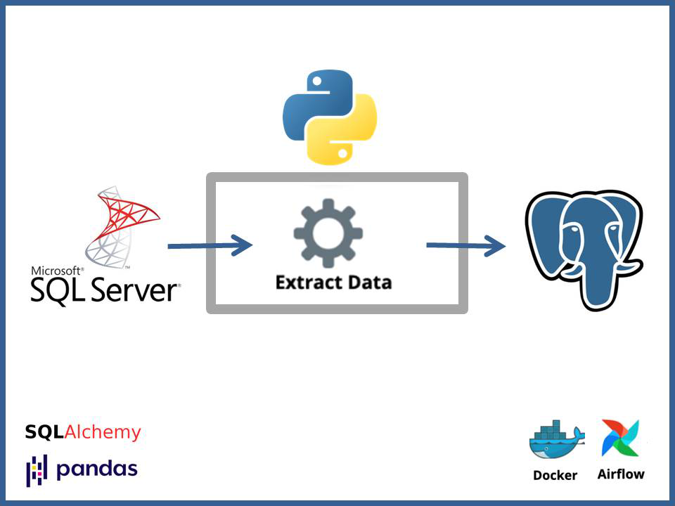
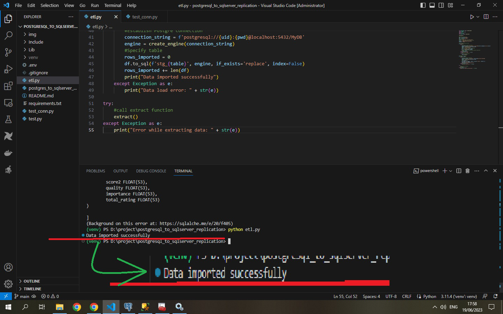
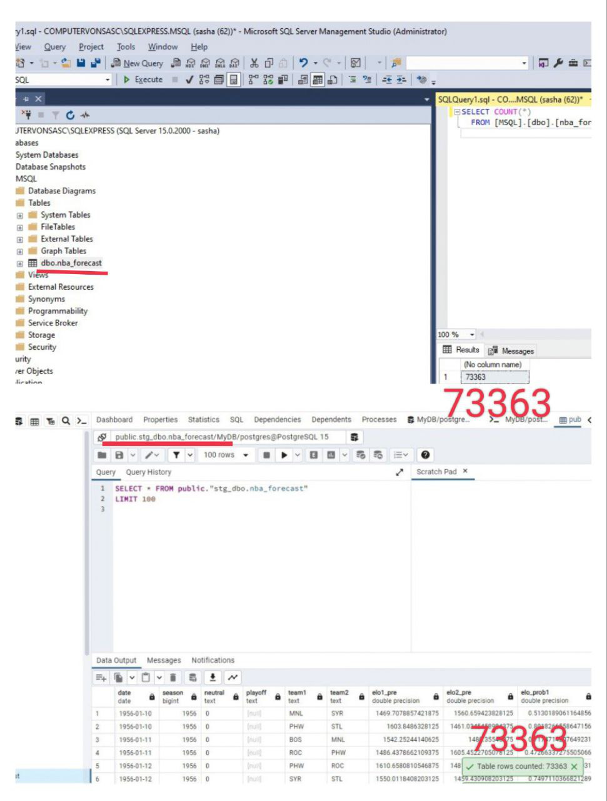

# I. PySpark ETL/EL

## MySQL=>PostgreSQL PySpark pipeline

The scripts provide flexibility: ETL - MySQL data extraction => aggregations => loads results to PostgreSQL; EL - allowing transformations at the destination database (aka ELT)

## Prerequisites

- Python 3.10, PySpark 3.4.1 were used
- MySQL & PostgreSQL installed, a dataset from Kaggle
- Download MySQL & PostgreSQL connector JAR files. 
Windows users: Choose Java 8 and download winutils.exe from [here](https://github.com/steveloughran/winutils/tree/master/hadoop-3.0.0/bin)
Linux/macOS users: ensure compatibility with correct versions of Hadoop and Spark.
- Add .env (JAVA_HOME, HADOOP_HOME)
- Disable Firewall, antivirus software, or create appropriate ingress rules

## Results

1. MySQL Dataset:   

2. Data Loaded:

3. MySQL=>PostgreSQL using PySpark:

4. Data with transformation imported:

# II. Pandas ETL/EL

A small simple task: a pipeline "MS SQL Server=>PostgreSQL"

## Prerequisites

- Python 3.x (pandas, SQLAlchemy)
- PostgreSQL, SQL Server databases configured
- Install Airflow with Docker, or in a separate repo to avoid conflicts with the script modules

1. Download and configure databases
2. Load a data sample to a database
3. Extract data using python
4. Transform (optionally)
5. Load to another db
   Optionally: Schedule with Airflow

## Result
 

  

